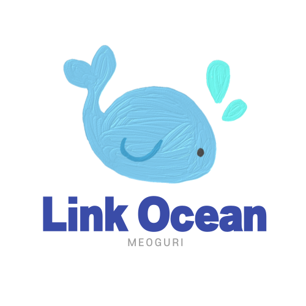
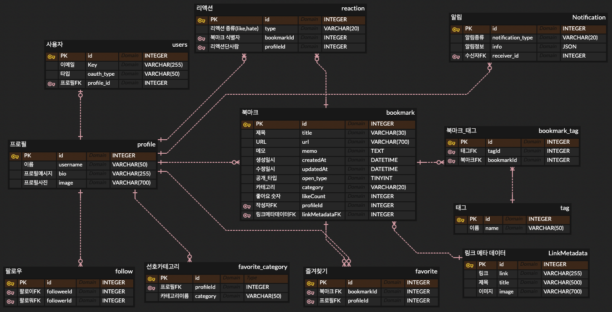

# Team-Meoguri-Linkocean-BE

  

## 프로젝트 소개

소셜 북마크 서비스

## 기획 배경 및 동기

개발공부 또는 인터넷을 통해 새로운 정보를 얻는 과정에서 좋은 웹 사이트를 발견하면, 나중을 위해 브라우저에서 제공하는 북마크 기능을 활용해 페이지를 저장해 둔다.

하지만 북마킹만 하고는 아쉬움이 남는다. 좋은 글을 나와 비슷한 관심사를 가진 친구들과 나누고 싶다. 그리고 나도 친구들이 좋다고 생각하는 글을 공유받아 읽어보고 싶다. 그런 서비스들이 존재하긴 하지만 대중적인
서비스는 존재하지 않는다.
소셜 북마킹 도메인은 누구에게나 친숙한 도메인이다. 또한 자주 사용하는 기능이기도 하다. 우리가 사용할 애플리케이션을 만들면 더 애정이 생기고 더 열심히 할 수 있지 않을까? 또 지금까지 불편했던 점을 우리가 만드는
애플리케이션에 녹여낼 수 있지 않을까?

## 기간

### 2022.07.21 ~ 2022.08.17

## 인원(소개)

<table>
  <tr>
    <td align="center"><b>Project Owner</b></td>
    <td align="center"><b>Developer</b></td>
    <td align="center"><b>Developer</b></td>
    <td align="center"><b>Developer</b></td>
</tr>
  <tr>
    <td>
        
    </td>
    <td>
        
    </td>
    <td>
        
    </td>
    <td>
        
    </td>
  </tr>

  <tr> 
    <td align="center"><a href="https://github.com/hyuk0309">hyuk0309</a></td>
    <td align="center"><a href="https://github.com/ndy2">ndy2</a></td>
    <td align="center"><a href="https://github.com/jk05018">jk05018</a></td>
    <td align="center"><a href="https://github.com/NewEgoDoc">NewEgoDoc</a></td>
  </tr>
</table>

## 사용 기술

## 협업

## architecture

### Backend

### CI/CD

## ERD-Diagram

## 위키

- 용례
- 규칙
- 패키지/클래스 구조도
- 깃 컨벤션

  

